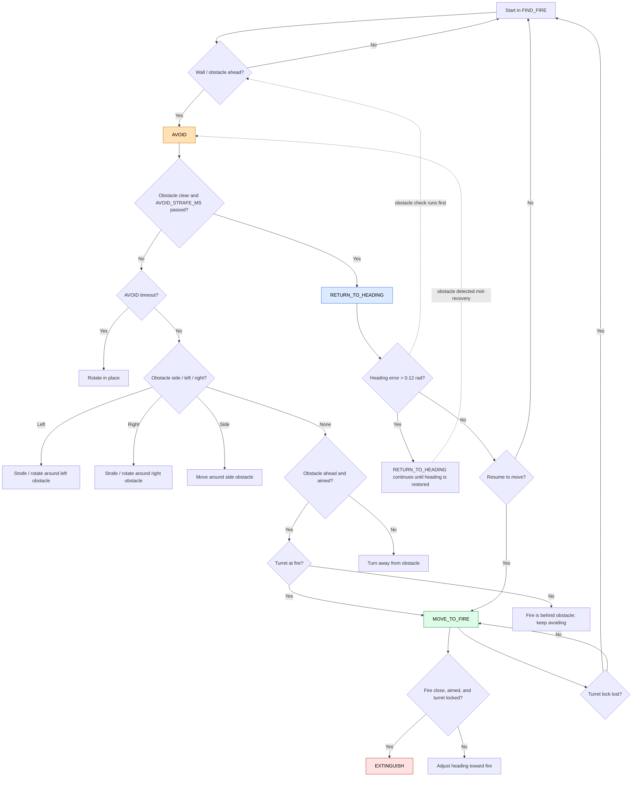

# Tracking flow chart

This diagram reflects the SEARCH sub-behaviour transitions in [tracking.cpp](tracking.cpp).

State mapping used by the code:

- FIND_FIRE: search / wall-follow mode
- AVOID: obstacle response
- RETURN_TO_HEADING: restore the original bearing after avoidance
- MOVE_TO_FIRE: steer toward the detected fire
- EXTINGUISH: fan-on state once the robot is close enough

Important detail: the obstacle / wall check has priority over RETURN_TO_HEADING in the code, so recovery can be interrupted and sent back into AVOID before it reaches the heading-restored branch.

If you want, I can also turn this into a compact ASCII version for the serial log or add a version annotated with the exact sensor conditions from the code.